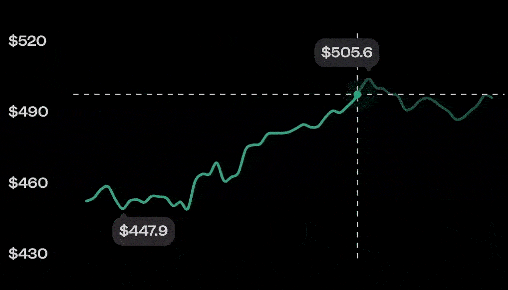

# @birdwingo/react-native-reanimated-graph

## About

`react-native-reanimated-graph` is a React Native component that provides a customizable and animated graph for displaying data. It allows you to visualize data points on a graph and supports various configuration options to customize the appearance and behavior of the graph.




## Installation

```bash
npm install react-native-svg
npm install react-native-reanimated
npm install react-native-gesture-handler
npm install @birdwingo/react-native-reanimated-graph
```

## Usage

To use the `ReanimatedGraph` component, you need to import it in your React Native application and include it in your JSX code. Here's an example of how to use it:

```jsx
import React, { useRef } from 'react';
import { View } from 'react-native';
import ReanimatedGraph, { ReanimatedGraphPublicMethods } from '@birdwingo/react-native-reanimated-graph';

const data = {
  // Your data points here
  xAxis: [0, 1, 2, 3, 4],
  yAxis: [0, 5, 2, 7, 4],
};

const YourComponent = () => {
  const graphRef = useRef<ReanimatedGraphPublicMethods>(null);

  const updateGraphData = () => {
    // Call this function to update the data displayed on the graph
    if (graphRef.current) {
      graphRef.current.updateData(data);
    }
  };

  return (
    <View>
      <ReanimatedGraph
        ref={graphRef}
        xAxis={data.xAxis}
        yAxis={data.yAxis}
        // Add any other props as needed
      />
    </View>
  );
};

export default YourComponent;
```

## Props

- `xAxis` (optional, default: `[0, 1]`): An array of numbers representing the x-axis values of the data points.

- `yAxis` (optional, default: `[0, 0]`): An array of numbers representing the y-axis values of the data points.

- `color` (optional, default: `'#FFFFFF'`): The color of the graph line.

- `widthRatio` (optional, default: `1`): The width ratio of the graph compared to available width.

- `selectionArea` (optional, default: `'default'`): The selection area type. The selection area is highlighted while hovering over the graph. Possible values are `'none'`, `'default'`, or `'custom'`. If `custom` you need to provide `selectionAreaData`, if `default`, selection area is to the left of the gesture point.

- `selectionAreaData` (optional, default: `[]`): An array of numbers representing the selection area data points.

- `height` (optional, default: `200`): The height of the graph component.

- `animated` (optional, default: `true`): Whether the graph should be animated.

- `animationDuration` (optional, default: 750): The duration of the animation in ms.

- `type` (optional, default: `'curve'`): The type of graph line. Possible values are `'curve'` or `'line'`.

- `maxPoints` (optional, default: `512`): The maximum number of data points to display on the graph. If the data has more points than `maxPoints`, the data will be reduced so that it does not affect the shape of the graph.

- `showXAxisLegend` (optional, default: `false`): Whether to show the x-axis legend.

- `xAxisLegendQuantity` (optional, default: `4`): The quantity of x-axis legend values to display.

- `showYAxisLegend` (optional, default: `false`): Whether to show the y-axis legend.

- `yAxisLegendQuantity` (optional, default: `4`): The quantity of y-axis legend values to display.

- `showExtremeValues` (optional, default: `true`): Whether to show extreme values (min and max) on the graph.

- `showBlinkingDot` (optional, default: `false`): Whether to show a blinking dot on the graph. (Will be placed at the last point of the graph)

- `showSelectionDot` (optional, default: `true`): Whether to show the selection dot on the graph while hovering.

- `selectionLines` (optional, default: `'both'`): The type of selection lines to display. Possible values are `'horizontal'`, `'vertical'`, `'both'`, or `'none'`.

- `selectionLineColor` (optional, default: `'#D4D4D4'`): The color of the selection lines.

- `gestureEnabled` (optional, default: `true`): Whether to enable gestures on the graph.

- `containerStyle` (optional): The style object to customize the container of the graph.

- `graphStyle` (optional): The style object to customize the graph.

- `textStyle` (optional): The style object to customize the text elements in the graph.

- `renderXAxisLegend` (optional): A function to render custom x-axis legend values. It takes two arguments:
  - `value` (number): The x-axis value for which the legend is being rendered.
  - `index` (number): The index of the x-axis value on legend.

- `renderYAxisLegend` (optional): A function to render custom y-axis legend values. It takes two arguments:
  - `value` (number): The y-axis value for which the legend is being rendered.
  - `index` (number): The index of the y-axis value on legend.

- `renderExtremeValue` (optional): A function to render custom extreme values. It takes two arguments:
  - `value` (number): The extreme value to be rendered.
  - `type` (`'min'` or `'max'`): The type of extreme value, either minimum or maximum.

- `onGestureStart` (optional): A callback function invoked when a gesture is started on the graph.

- `onGestureEnd` (optional): A callback function invoked when a gesture is ended on the graph.

- `onGestureUpdate` (optional): A callback function invoked when a gesture is updated on the graph. It takes three arguments:
  - `xValue` (number): The x-axis value at the position of the gesture.
  - `yValue` (number): The y-axis value at the position of the gesture.
  - `index` (number): The index of the nearest data point to the gesture position.

## Public Methods

- `updateData(data: { xAxis: number[], yAxis: number[], color?: string, widthRatio?: number, selectionArea?: 'none' | 'default' | 'custom', selectionAreaData?: number[], showBlinkingDot?: boolean }): void`: Use this method to update the data displayed on the graph dynamically.

## Sponsor

**react-native-reanimated-graph** is sponsored by [Birdwingo](https://www.birdwingo.com).\
Download Birdwingo mobile app to see react-native-reanimated-graph in action!